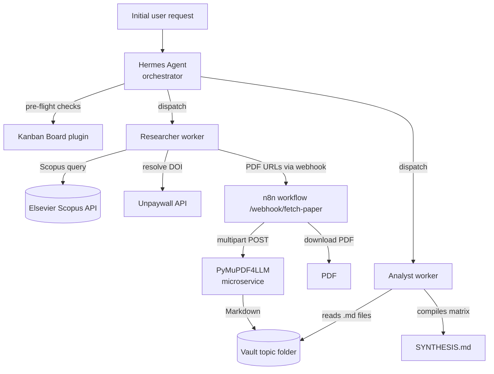

# Literature Pseudo-RAG System

[](LICENSE)

An automated agentic pipeline that discovers open-access academic papers on a user-specified topic, converts them to Markdown, and synthesizes a structured literature matrix. The entire workflow is orchestrated as a multi-agent workflow by the Hermes Agent Kanban Board plugin, with n8n as the async PDF-processing backend.

> I tagged this RAG system as "Pseudo" because this project deliberately does not use an embedding model or a vector database. The retrieved papers are stored as Markdown files in a folder on the Hermes Agent's local environment, when the user queries the corpus, the sources are read directly rather than through semantic search. It is a lightweight retrieval-and-storage system that reuses the retrieved sources. It's fast to run, and free of vector-db infrastructure.

## Disclaimer

AI was used to assist in the making of this project, the coding, bash commands, linux commands were done using the assistance of AI and these processes were mostly done on the last step. The architecture (n8n), system design, API tools (Elsevier Scopus API and Unpaywall REST API) implemented were researched online from reddit posts, github and stackoverflow.

This is also a project done by an average student.
## Overview

The system is an automated pipeline that:

1. **Discovers** open-access academic papers on a user-specific topic (Elsevier Scopus + Unpaywall)
2. **Converts** them to `.md` files via a PyMuPDF4LLM microservice running in a container
3. **Synthesizes** a structured literature matrix (`SYNTHESIS.md`)

It operates as a multi-agent workflow orchestrated via the Hermes built-in Kanban Boards plugin (saves token costs, gives predictable deterministic behavior), with a local n8n container as the backend and API integrations to Elsevier Scopus and Unpaywall.

## Architecture



1. **Initial User Request**

2. **Hermes Request Digestion as Orchestrator**
   - Performs pre-flight checks (n8n container health, webhook response, vault directory)
   - Uses the Kanban Board plugin to allocate tasks to two designated worker profiles
   - Dispatches, spawning workers sequentially

   - **Researcher Worker**
     a. Queries the Scopus API
     b. Resolves DOIs via the Unpaywall API
     c. Streams PDF URLs to the n8n webhook
     d. Waits for PyMuPDF4LLM conversion

   - **Analyst Worker**
     a. Reads the `.md` files
     b. Compiles the literature matrix
     c. Writes `SYNTHESIS.md`

3. **n8n container workflow** (`/webhook/fetch-paper`)
   - Downloads the PDFs from the links provided by the Researcher Worker
   - Forwards them to the PyMuPDF4LLM microservice
   - After conversion, writes the `.md` file to disk in the local topic folder

## Requirements

- Hermes Agent (or any agentic AI harness)
- n8n
- PyMuPDF4LLM Python microservice
- Elsevier API Key (Scopus Search API)
- Unpaywall API (free — no key, an email address is sufficient)
- Python 3

## Quick Start

1. Clone the repo and bring up the backend:

   ```bash
   docker compose up --build
   ```

   This starts n8n (port 5678) and the PyMuPDF4LLM microservice (port 5001).

2. Import the n8n workflow: n8n UI → **Workflows → Import from File** → `n8n/pdftomd_n8n.json`

3. Copy the environment template and fill in your key:

   ```bash
   cp .env.example .env   # set ELSEVIER_API_KEY and UNPAYWALL_EMAIL
   ```

4. Install the orchestrator skill into your Hermes Agent:

   ```bash
   mkdir -p ~/.hermes/skills/research/literature-rag/
   cp orchestrator/literature_rag_skill.md ~/.hermes/skills/research/literature-rag/SKILL.md
   ```

   - The directory name (`literature-rag`) is the skill's slug; the file MUST be named `SKILL.md` for Hermes to load it.
   - The YAML frontmatter inside the file (`name: literature-rag`) must match the directory name.
   - The skill depends on the `hermes kanban` CLI, two Hermes worker profiles named `researcher` and `analyst`, and the `ELSEVIER_API_KEY` environment variable. If you use a different agentic harness, follow that harness's skill-directory convention — the file body is portable.

5. Run the orchestrator skill (`orchestrator/literature_rag_skill.md`) inside Hermes with your research topic.

6. Read the generated `SYNTHESIS.md` from the vault topic folder (mounted at `/workspace` inside n8n).

You can check out the file inside the docs folder for more information on configuration. docs/03_Configuration.md , there's a link inside that points to the Elsevier Developer portal to get your API key.

## Project Structure

```
literature-pseudo-rag/
  README.md                     This file
  docker-compose.yml            Backend: n8n + PyMuPDF4LLM microservice
  .env.example                  Environment template (no secrets)
  docs/                         Architecture, flow, configuration, ops, troubleshooting
    00_Overview.md
    01_Pipeline_Components.md
    02_Pipeline_Flow.md
    03_Configuration.md
    04_Operational_Guide.md
    05_Troubleshooting.md
    06_Reference.md
  n8n/
    pdftomd_n8n.json            Importable n8n workflow (PDF -> Markdown)
    pdftomd_n8n.md              Human-readable walkthrough of the workflow
  pdf_service/
    server.py                   Flask microservice: PyMuPDF4LLM PDF -> Markdown
    Dockerfile
    requirements.txt
  orchestrator/
    literature_rag_skill.md     The Hermes skill that drives the whole pipeline
    references/                 Operational case studies & debugging notes
  scripts/
    fetch_papers.example.py     Researcher worker logic (Scopus -> Unpaywall -> n8n)
  examples/
    ..._SYNTHESIS.md            A real literature matrix produced by the pipeline
```

## Sample Output

See `examples/` for a real literature synthesis produced by this pipeline
(topic: *Token Optimization and Pruning Methods for Large Language Models*).
It shows the exact shape of the analyst's deliverable: per-paper deep dives,
technical innovation breakdowns, comparison tables, and a cross-paper synthesis.

## Design Decisions

This Pseudo-RAG System is not without limitations and because of some glaring
flaws, the "Pseudo" tag was attached to the thing.

- **Kanban-based orchestration**
  I used the built-in Kanban Board plugin in Hermes because it was really
  convenient to troubleshoot and see the logs of each of the worker profiles if
  there were any issues. This also allowed Hermes to see what issues were met and
  auto-troubleshoot them. It also had automatic worker spawning after a task was
  flagged as completed by the previously spawned worker.

- **PyMuPDF4LLM PDF-Markdown microservice**
  Initially, I chose to use a locally hosted tiny AI OCR model called Docling to
  turn PDFs into markdown files. However, due to a lack of a GPU and how heavy and
  slow running a locally hosted AI model is — especially on a Virtual Private
  Server — I instead opted for a Python microservice I found from a Reddit post
  called PyMuPDF4LLM. It accurately and quickly converts PDFs to Markdown in a
  matter of seconds, compared to Docling's 30-minute timeframe.

- **Deduplication via a stored `processed_dois.txt` file**
  To ensure the DOIs retrieved from the Elsevier Scopus API are not duplicated
  across runs, a `processed_dois.txt` file is used as a library for Hermes to
  compare against. If a DOI was previously processed, it is skipped and the
  pipeline searches for another one.

## Limitations

- No semantic search: retrieval is folder-based (Markdown files), not embedding-based.
- Output quality depends on open-access availability (Unpaywall best-available match).
- Paper count per run is capped (configurable) to keep API usage and token spend deterministic.

## Tech Stack

Hermes Agent (multi-agent kanban orchestration) · n8n · Elsevier Scopus Search API · Unpaywall · PyMuPDF4LLM · Python 3 · Docker

## License

[MIT](LICENSE)